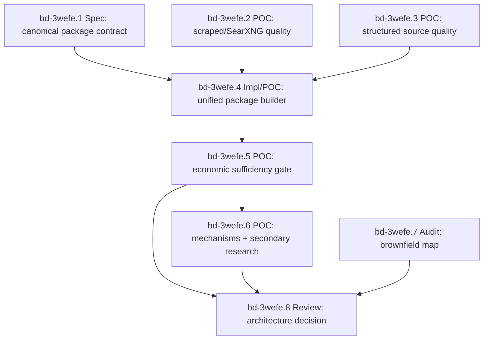

# 2026-04-14 Evidence Package Dependency Lockdown (bd-3wefe)

## Status

Self-documenting Beads epic for the next Affordabot evidence-quality wave.

Parent evidence history: `bd-2agbe`

Executable dependency epic: `bd-3wefe`

Draft PR carrying current evidence artifacts: <https://github.com/stars-end/affordabot/pull/436>

## Why This Exists

The architecture discussion has converged on one important constraint: the data moat and the economic analysis product cannot be evaluated as one blob. Search quality, structured source coverage, package assembly, economic sufficiency, secondary research, and brownfield reuse all fail in different ways.

This epic encodes those dependencies so future agents do not jump directly from "we found documents" to "we can produce quantitative cost-of-living analysis."

## Core Decision

Keep the target architecture open until the dependency gates below produce evidence.

The current default remains:

- Windmill owns orchestration: schedules, fanout, retries, branch routing, run visibility, and calls into backend commands.
- Affordabot backend owns product logic: source ranking policy, artifact classification, evidence packaging, economic mechanisms, assumptions, formulas, LLM guardrails, and persistence invariants.
- Postgres owns relational truth: run records, evidence packages, cards, gate reports, and read models.
- pgvector owns retrieval indexes/chunks tied to canonical document identity and jurisdiction.
- MinIO owns raw and intermediate artifacts: HTML/PDF/text, reader output, provider responses, prompts, LLM outputs, and large extraction payloads.
- Frontend owns display only: public narratives and admin glassbox views. It must not recompute economic truth.

Do not lock this as final until `bd-3wefe.8` completes.

## Quality Questions Mapped To Beads

| User question | Beads task | Required output |
| --- | --- | --- |
| Can scraped/SearXNG sources produce high-quality evidence? | `bd-3wefe.2` | Audited scraped-source package samples with search/ranking/reader/extraction attribution |
| Can multiple structured sources produce high-quality evidence? | `bd-3wefe.3` | Audited structured-source package samples and coverage matrix |
| Have we broadly expanded free, easily ingestible structured sources? | `bd-3wefe.3` | Free/key/signup status and source family breadth |
| Can scraped and structured results be unified cleanly? | `bd-3wefe.4` | Backend-owned `PolicyEvidencePackage` builder |
| Is the unified package sufficient for economic analysis? | `bd-3wefe.5` | Sufficiency verifier with positive and fail-closed examples |
| Can the economic engine handle direct and indirect costs? | `bd-3wefe.6` | Direct, indirect, and secondary-research-required cases |
| Can the engine use a secondary web research package? | `bd-3wefe.6` | Secondary package contract and consumption evidence |
| Are we duplicating existing code paths? | `bd-3wefe.7` | Brownfield map and duplication/consolidation recommendations |

## Dependency Graph

## Beads Epic

### `bd-3wefe`: Affordabot evidence package dependency lockdown

Acceptance:

- Source-quality evidence exists for scraped and structured lanes.
- A unified backend-owned package contract exists.
- Economic handoff sufficiency is tested with positive and fail-closed examples.
- Direct, indirect, and secondary-research cases are tested.
- Existing stack usage and duplication are audited.
- External review can evaluate a complete evidence-backed architecture recommendation.

## Child Tasks

### `bd-3wefe.1`: Spec: canonical PolicyEvidencePackage contract and quality taxonomy

Purpose:

Define the canonical envelope and vocabulary before implementation expands.

Acceptance:

- Defines `PolicyEvidencePackage`, source/evidence/parameter/assumption/model relationships, failure codes, source roles, freshness, schema/versioning, and what must be true before analysis runs.

### `bd-3wefe.2`: POC: scraped/SearXNG evidence quality package samples

Purpose:

Prove or falsify private SearXNG as primary discovery for policy artifacts, with Tavily as hot fallback and Exa as capped bakeoff/eval only.

Acceptance:

- Produces at least three audited scraped-source package samples.
- Separates search recall, candidate ranking, reader substance, and evidence extraction failures.
- Shows whether each sample can support economic parameters without LLM invention.

### `bd-3wefe.3`: POC: structured source evidence quality package samples

Purpose:

Expand free/easily ingestible structured sources and prove whether they produce economically useful facts.

Acceptance:

- Covers multiple structured source families.
- Records free/key/signup status and sample endpoint/file evidence.
- Produces at least three package samples with economic mechanism relevance or explicit insufficiency.

### `bd-3wefe.4`: Impl/POC: unified scraped plus structured PolicyEvidencePackage builder

Purpose:

Merge scraped and structured lanes without moving product invariants into Windmill scripts.

Acceptance:

- Produces versioned packages with canonical document identity, source provenance, dedupe groups, retrieval/read status, evidence cards, freshness, and explicit insufficiency reasons.
- Handles both scraped and structured inputs through one backend-owned contract.

### `bd-3wefe.5`: POC: economic engine package sufficiency gate

Purpose:

Test whether the unified package has enough detail to feed economic analysis.

Acceptance:

- Emits pass/fail and blocking gate for completeness, parameter readiness, assumption needs, source support, uncertainty, and unsupported-claim risk.
- Includes positive and fail-closed examples.

### `bd-3wefe.6`: POC: direct and indirect economic mechanisms plus secondary research

Purpose:

Test whether the analysis layer can handle regulations with indirect effects, not just direct fiscal costs.

Acceptance:

- Includes one direct-cost case.
- Includes one indirect mechanism case.
- Includes one secondary-research-required case.
- Final explanation consumes deterministic cards and does not introduce unsupported values.

### `bd-3wefe.7`: Audit: brownfield pipeline map and duplication check

Purpose:

Prevent a Frankenstein implementation by mapping what already exists before adding more.

Acceptance:

- Identifies existing backend, frontend, Windmill, Postgres, pgvector, MinIO, Z.ai reader/LLM, SearXNG, Tavily/Exa, and structured-source code paths.
- Identifies duplicated POC code to delete or consolidate.
- Names canonical files/routes/jobs/tables to extend in the implementation wave.

### `bd-3wefe.8`: Review: architecture decision after package POCs

Purpose:

Only after evidence exists, run internal/external review and lock the next implementation architecture.

Acceptance:

- Review package includes this spec, POC outputs, brownfield audit, decision matrix, recommended architecture, unresolved risks, and reviewer feedback.

## Blocking Edges

Hard blockers:

- `bd-3wefe.1` blocks `bd-3wefe.4`
- `bd-3wefe.2` blocks `bd-3wefe.4`
- `bd-3wefe.3` blocks `bd-3wefe.4`
- `bd-3wefe.4` blocks `bd-3wefe.5`
- `bd-3wefe.5` blocks `bd-3wefe.6`
- `bd-3wefe.5` blocks `bd-3wefe.8`
- `bd-3wefe.6` blocks `bd-3wefe.8`
- `bd-3wefe.7` blocks `bd-3wefe.8`

Parallelizable first wave:

- `bd-3wefe.1`
- `bd-3wefe.2`
- `bd-3wefe.3`
- `bd-3wefe.7`

For a two-agent implementation wave, run:

- Agent A: `bd-3wefe.1` plus `bd-3wefe.7` if time remains.
- Agent B: `bd-3wefe.2` and `bd-3wefe.3` as source-quality evidence work.

## Validation Gates

Before `bd-3wefe.8` can recommend architecture lock:

- Scraped lane: search/ranking/reader/extraction failures are independently attributable.
- Structured lane: source breadth, access status, and economic usefulness are documented with machine-readable artifacts.
- Unified package: scraped and structured examples share one versioned backend-owned package shape.
- Economic sufficiency: verifier distinguishes quantified-ready, secondary-research-needed, qualitative-only, and fail-closed packages.
- Mechanism coverage: at least one direct and one indirect economic path are demonstrated.
- Secondary research: research package is explicitly separate from first-pass policy artifact gathering.
- Brownfield map: implementation plan extends existing code rather than duplicating POC scripts.
- Review readiness: artifacts are sufficient for dx-review/external consultant evaluation.

## Evidence Artifacts To Carry Forward

- `docs/specs/2026-04-14-economic-evidence-pipeline-lockdown.md`
- `docs/poc/source-integration/final_source_strategy_recommendation.md`
- `docs/poc/source-integration/artifacts/scrape_structured_integration_report.json`
- `docs/poc/source-expansion/artifacts/source_expansion_api_key_matrix.json`
- `docs/poc/economic-analysis-boundary/architecture_recommendation.md`
- `docs/reviews/2026-04-14-dx-review-economic-pipeline-architecture.md`

## Non-Goals

- No production rollout decision in this epic.
- No migration of economic logic into Windmill scripts.
- No new paid data-provider dependency unless a POC proves the free/private route is insufficient.
- No frontend recomputation of business logic.

## First Task

Start with `bd-3wefe.1`, because it defines the package contract used by the POCs and the implementation tasks.

If running two agents immediately, run `bd-3wefe.1` in parallel with `bd-3wefe.2`/`bd-3wefe.3` evidence collection. Keep `bd-3wefe.4` blocked until all three inputs are complete.
