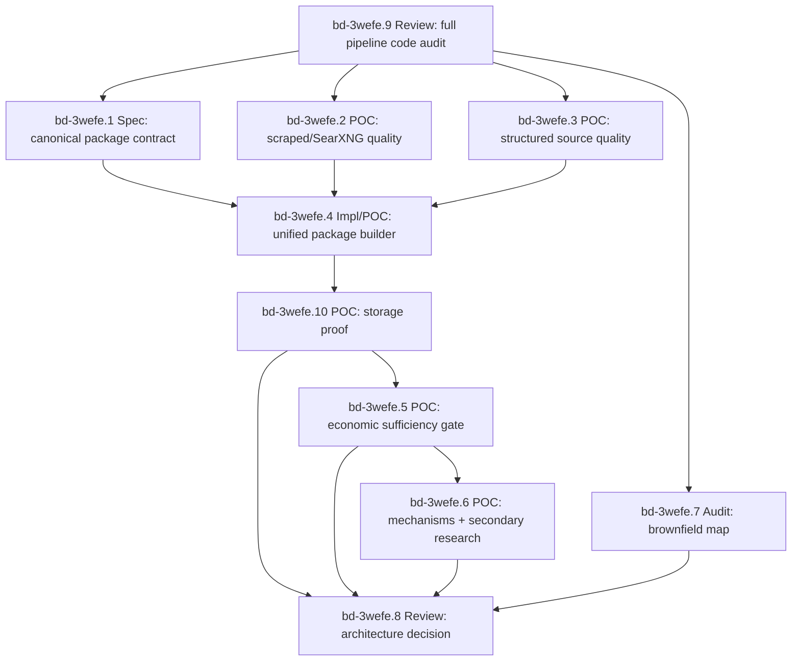

# 2026-04-14 Evidence Package Dependency Lockdown (bd-3wefe)

## Status

Self-documenting Beads epic for the next Affordabot evidence-quality wave.

Parent evidence history: `bd-2agbe`

Executable dependency epic: `bd-3wefe`

Draft PR carrying current evidence artifacts: <https://github.com/stars-end/affordabot/pull/436>

## Why This Exists

The architecture discussion has converged on one important constraint: the data moat and the economic analysis product cannot be evaluated as one blob. Search quality, structured source coverage, package assembly, storage proof, economic sufficiency, secondary research, final analysis, and brownfield reuse all fail in different ways.

This epic encodes those dependencies so future agents do not jump directly from "we found documents" to "we can produce quantitative cost-of-living analysis."

## Core Decision

Keep the target architecture open until the dependency gates below produce evidence.

The current default remains:

- Windmill owns orchestration: schedules, fanout, retries, branch routing, run visibility, and calls into backend commands.
- Affordabot backend owns product logic: source ranking policy, artifact classification, evidence packaging, economic mechanisms, assumptions, formulas, LLM guardrails, and persistence invariants.
- Postgres owns relational truth: run records, evidence packages, cards, gate reports, and read models.
- pgvector owns retrieval indexes/chunks tied to canonical document identity and jurisdiction.
- MinIO owns raw and intermediate artifacts: HTML/PDF/text, reader output, provider responses, prompts, LLM outputs, and large extraction payloads.
- Frontend owns display only: public narratives and admin glassbox views. It must not recompute economic truth.

Do not lock this as final until `bd-3wefe.8` completes.

Important sequencing correction:

Before the package spec or new POCs proceed, run `bd-3wefe.9`, a code-review-style `dx-review` of the existing raw/structured-data-to-analysis pipeline. The repo already contains economic analysis, evidence gates, storage, admin, frontend, reader, search, and Windmill/domain-bridge code. New work must extend that system, not rediscover or duplicate it.

## Quality Questions Mapped To Beads

| User question | Beads task | Required output |
| --- | --- | --- |
| What already exists in the raw/structured-data-to-analysis pipeline? | `bd-3wefe.9` | dx-review code audit with findings, exact code paths, existing economic capabilities, and duplication risks |
| Can scraped/SearXNG sources produce high-quality evidence? | `bd-3wefe.2` | Metric-based scraped-source quality report with search/ranking/reader/evidence attribution |
| Can multiple structured sources produce high-quality evidence? | `bd-3wefe.3` | Audited structured-source package samples and canonical source catalog |
| Have we broadly expanded free, easily ingestible structured sources? | `bd-3wefe.3` | Source catalog with free/key/signup/cadence/coverage/relevance/storage fields |
| Can scraped and structured results be unified cleanly? | `bd-3wefe.4` | Backend-owned `PolicyEvidencePackage` builder |
| How is the combined package stored and audited? | `bd-3wefe.10` | Postgres/MinIO/pgvector/read-API persistence proof with replay and partial-write evidence |
| Is the unified package sufficient for economic analysis? | `bd-3wefe.5` | Sufficiency verifier over persisted/read-back packages |
| Can the economic engine handle direct and indirect costs? | `bd-3wefe.6` | Direct, indirect, and secondary-research-required cases with quantitative-analysis rubric |
| Can the engine use a secondary web research package? | `bd-3wefe.6` | Secondary package contract and consumption evidence |
| Are we duplicating existing code paths? | `bd-3wefe.7` | Brownfield map and duplication/consolidation recommendations |

## Dependency Graph

## Beads Epic

### `bd-3wefe`: Affordabot evidence package dependency lockdown

Acceptance:

- Pre-spec dx-review code audit maps the existing raw/structured-data-to-analysis pipeline.
- Source-quality evidence exists for scraped and structured lanes.
- A unified backend-owned package contract exists.
- Storage/persistence proof exists across Postgres, MinIO, pgvector, and admin/read APIs.
- Economic handoff sufficiency is tested with positive and fail-closed examples.
- Direct, indirect, and secondary-research cases are tested.
- Existing stack usage and duplication are audited by dx-review and a brownfield map.
- External review can evaluate a complete evidence-backed architecture recommendation.

## Child Tasks

### `bd-3wefe.9`: Review: dx-review full pipeline code audit before package design

Purpose:

Force a reviewer-grade code audit before the next spec/POC wave, so we do not miss already-built pipeline capabilities.

Required scope:

- Raw scrape ingestion and artifact promotion.
- Structured sources and existing adapters.
- Private SearXNG, Tavily, Exa, and provider fallback code.
- Z.ai reader and reader-substance gates.
- Postgres, pgvector, MinIO, content hashes, replay/idempotency, and read APIs.
- `AnalysisPipeline`, `LegislationResearchService`, evidence/economic schemas, deterministic gates, assumption registry, and LLM analysis.
- Admin endpoints and frontend display/glassbox behavior.
- Windmill/domain bridge versus canonical backend analysis paths.

Acceptance:

- Produces a code-review artifact with findings first, exact file/path citations, existing raw-to-final-result pipeline map, already-built economic analysis capabilities, duplicate/obsolete POC paths, storage truth table, search/reader/data-quality gaps, and implementation recommendations.
- Uses `dx-review` with explicit code-review framing.
- Requires either two-provider review quorum or a documented failed lane with logs, failure class, and one retry or explicit exception.

### `bd-3wefe.1`: Spec: canonical PolicyEvidencePackage contract and quality taxonomy

Purpose:

Define the canonical envelope and vocabulary before implementation expands.

Acceptance:

- Defines `PolicyEvidencePackage`, source/evidence/parameter/assumption/model relationships, failure codes, source roles, freshness, schema/versioning, and what must be true before analysis runs.
- Incorporates `bd-3wefe.9` findings so the contract extends existing code paths rather than inventing parallel schemas.

### `bd-3wefe.2`: POC: scraped/SearXNG evidence quality package samples

Purpose:

Prove or falsify private SearXNG as primary discovery for policy artifacts, with Tavily as hot fallback and Exa as capped bakeoff/eval only.

Acceptance:

- Produces at least three audited scraped-source package samples.
- Separates search recall, candidate ranking, reader substance, and evidence extraction failures.
- Shows whether each sample can support economic parameters without LLM invention.
- Reports metric-based quality by provider/query family: top-N artifact recall, official-domain hit rate, first-artifact rank, backend selected candidate, portal-skip decisions, reader-substance pass rate, numeric parameter signal rate, fallback trigger rate, latency, and failure class.
- Treats "provider found a relevant-looking URL" as insufficient unless the selected/read artifact survives the reader and evidence-card gates.

### `bd-3wefe.3`: POC: structured source evidence quality package samples

Purpose:

Expand free/easily ingestible structured sources and prove whether they produce economically useful facts.

Acceptance:

- Covers multiple structured source families.
- Records free/key/signup status and sample endpoint/file evidence.
- Produces at least three package samples with economic mechanism relevance or explicit insufficiency.
- Emits a canonical source-catalog manifest with access method, key requirement, signup URL, cadence/freshness, jurisdiction coverage, policy-domain relevance, storage target, curation status, economic usefulness score, and whether each source is `structured_lane`, `scrape_reader_lane`, `contextual`, or `backlog`.

### `bd-3wefe.4`: Impl/POC: unified scraped plus structured PolicyEvidencePackage builder

Purpose:

Merge scraped and structured lanes without moving product invariants into Windmill scripts.

Acceptance:

- Produces versioned packages with canonical document identity, source provenance, dedupe groups, retrieval/read status, evidence cards, freshness, and explicit insufficiency reasons.
- Handles both scraped and structured inputs through one backend-owned contract.
- Validates package output against backend-owned schemas where available.
- Emits storage references for raw provider responses, raw/read artifacts, derived chunks, cards, gate reports, and final analysis payloads, but does not claim storage correctness until `bd-3wefe.10` passes.

### `bd-3wefe.10`: POC: storage persistence and read-model proof for evidence packages

Purpose:

Prove that the unified evidence package is durably stored and auditable through the actual storage stack.

Acceptance:

- Proves package rows, cards, gate reports, and run metadata persist in Postgres.
- Proves MinIO objects referenced by `storage_uri` and `content_hash` are readable through the actual storage client.
- Proves pgvector chunks are derived from canonical artifacts and are not treated as source of truth.
- Proves admin/read API output exposes package status, blocking gate, evidence/parameter/assumption/model cards, source provenance, and storage refs.
- Includes idempotent replay and partial-write/rollback or compensation drills.
- Treats any unprobeable storage layer as a blocking finding, not a pass.

### `bd-3wefe.5`: POC: economic engine package sufficiency gate

Purpose:

Test whether the unified package has enough detail to feed economic analysis.

Acceptance:

- Emits pass/fail and blocking gate for completeness, parameter readiness, assumption needs, source support, uncertainty, and unsupported-claim risk.
- Includes positive and fail-closed examples.
- Runs against persisted/read-back packages from `bd-3wefe.10`, not only in-memory fixtures.

### `bd-3wefe.6`: POC: direct and indirect economic mechanisms plus secondary research

Purpose:

Test whether the analysis layer can handle regulations with indirect effects, not just direct fiscal costs.

Acceptance:

- Includes one direct-cost case.
- Includes one indirect mechanism case.
- Includes one secondary-research-required case.
- Final explanation consumes deterministic cards and does not introduce unsupported values.
- Each case includes a mechanism graph, parameter table, source-bound evidence, explicit assumption cards, low/base/high or sensitivity range, uncertainty notes, unsupported-claim rejection, and a user-facing cost-of-living conclusion.
- Secondary research is represented as a second evidence package with provider/query provenance, source ranking, reader output, and assumption applicability, not as hidden LLM context.

### `bd-3wefe.7`: Audit: brownfield pipeline map and duplication check

Purpose:

Prevent a Frankenstein implementation by mapping what already exists before adding more.

Acceptance:

- Identifies existing backend, frontend, Windmill, Postgres, pgvector, MinIO, Z.ai reader/LLM, SearXNG, Tavily/Exa, and structured-source code paths.
- Identifies duplicated POC code to delete or consolidate.
- Names canonical files/routes/jobs/storage tables to extend in the implementation wave.
- Incorporates `bd-3wefe.9` review findings and turns them into concrete reuse/delete/extend recommendations.

### `bd-3wefe.8`: Review: architecture decision after package POCs

Purpose:

Only after evidence exists, run internal/external review and lock the next implementation architecture.

Acceptance:

- Review package includes this spec, POC outputs, brownfield audit, decision matrix, recommended architecture, unresolved risks, and reviewer feedback.
- Requires two-provider `dx-review` quorum for architecture lock, or an explicit documented exception with failed-lane logs, failure class, and a re-run attempt after auth/tooling remediation.

## Blocking Edges

Hard blockers:

- `bd-3wefe.9` blocks `bd-3wefe.1`
- `bd-3wefe.9` blocks `bd-3wefe.2`
- `bd-3wefe.9` blocks `bd-3wefe.3`
- `bd-3wefe.9` blocks `bd-3wefe.7`
- `bd-3wefe.1` blocks `bd-3wefe.4`
- `bd-3wefe.2` blocks `bd-3wefe.4`
- `bd-3wefe.3` blocks `bd-3wefe.4`
- `bd-3wefe.4` blocks `bd-3wefe.10`
- `bd-3wefe.10` blocks `bd-3wefe.5`
- `bd-3wefe.10` blocks `bd-3wefe.8`
- `bd-3wefe.5` blocks `bd-3wefe.6`
- `bd-3wefe.5` blocks `bd-3wefe.8`
- `bd-3wefe.6` blocks `bd-3wefe.8`
- `bd-3wefe.7` blocks `bd-3wefe.8`

Required first step:

- `bd-3wefe.9`

Parallelizable second wave:

- `bd-3wefe.1`
- `bd-3wefe.2`
- `bd-3wefe.3`
- `bd-3wefe.7`

For a two-agent wave after `bd-3wefe.9`, run:

- Agent A: `bd-3wefe.1` plus `bd-3wefe.7` if time remains.
- Agent B: `bd-3wefe.2` and `bd-3wefe.3` as source-quality evidence work.

## Validation Gates

Before `bd-3wefe.8` can recommend architecture lock:

- Code audit: dx-review has mapped existing raw/structured-data-to-analysis code and identified already-built economic capabilities.
- Scraped lane: search/ranking/reader/extraction failures are independently attributable.
- Scraped lane: metric-based quality covers artifact recall, ranker selection, portal skip, reader substance, numeric signal, fallback behavior, latency, and failure classes.
- Structured lane: source breadth, access status, and economic usefulness are documented with machine-readable artifacts.
- Structured lane: source catalog captures access method, cadence, jurisdiction coverage, curation state, storage target, and economic usefulness.
- Unified package: scraped and structured examples share one versioned backend-owned package shape.
- Storage: Postgres/MinIO/pgvector/admin-read proof is based on persisted/read-back artifacts, not only generated JSON fixtures.
- Economic sufficiency: verifier distinguishes quantified-ready, secondary-research-needed, qualitative-only, and fail-closed packages.
- Mechanism coverage: at least one direct and one indirect economic path are demonstrated.
- Secondary research: research package is explicitly separate from first-pass policy artifact gathering.
- Brownfield map: implementation plan extends existing code rather than duplicating POC scripts.
- Final analysis: output includes mechanism graph, parameter table, source-bound assumptions, uncertainty/sensitivity, unsupported-claim checks, and cost-of-living conclusion.
- Review readiness: artifacts are sufficient for dx-review/external consultant evaluation with two-provider quorum or a documented exception.

## Evidence Artifacts To Carry Forward

- `docs/specs/2026-04-14-economic-evidence-pipeline-lockdown.md`
- `docs/poc/source-integration/final_source_strategy_recommendation.md`
- `docs/poc/source-integration/artifacts/scrape_structured_integration_report.json`
- `docs/poc/source-expansion/artifacts/source_expansion_api_key_matrix.json`
- `docs/poc/economic-analysis-boundary/architecture_recommendation.md`
- `docs/reviews/2026-04-14-dx-review-economic-pipeline-architecture.md`
- Future `bd-3wefe.9` dx-review code-audit artifact

## Non-Goals

- No production rollout decision in this epic.
- No migration of economic logic into Windmill scripts.
- No new paid data-provider dependency unless a POC proves the free/private route is insufficient.
- No frontend recomputation of business logic.

## First Task

Start with `bd-3wefe.9`, because it determines what already exists in the codebase and prevents the next contract from duplicating working pipeline pieces.

After `bd-3wefe.9`, run `bd-3wefe.1` in parallel with `bd-3wefe.2`/`bd-3wefe.3` evidence collection. Keep `bd-3wefe.4` blocked until all three inputs are complete, keep `bd-3wefe.5` blocked until `bd-3wefe.10` proves persisted/read-back package storage, and keep `bd-3wefe.6` blocked until package sufficiency passes.
