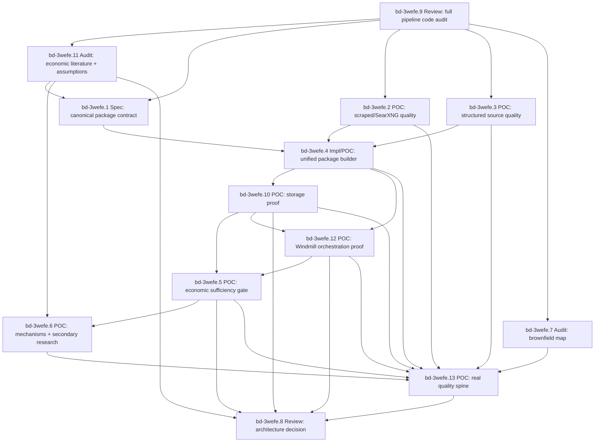

# 2026-04-14 Evidence Package Dependency Lockdown (bd-3wefe)

## Status

Self-documenting Beads epic for the next Affordabot evidence-quality wave.

Parent evidence history: `bd-2agbe`

Executable dependency epic: `bd-3wefe`

Draft PR carrying current evidence artifacts: <https://github.com/stars-end/affordabot/pull/436>

## Why This Exists

The architecture discussion has converged on one important constraint: the data moat and the economic analysis product cannot be evaluated as one blob. Search quality, structured source coverage, package assembly, storage proof, economic sufficiency, secondary research, final analysis, and brownfield reuse all fail in different ways.

This epic encodes those dependencies so future agents do not jump directly from "we found documents" to "we can produce quantitative cost-of-living analysis."

## Core Decision

Keep the target architecture open until the dependency gates below produce evidence.

The current default remains:

- Windmill owns orchestration: schedules, fanout, retries, branch routing, run visibility, and calls into backend commands.
- Affordabot backend owns product logic: source ranking policy, artifact classification, evidence packaging, economic mechanisms, assumptions, formulas, LLM guardrails, and persistence invariants.
- Postgres owns relational truth: run records, evidence packages, cards, gate reports, and read models.
- pgvector owns retrieval indexes/chunks tied to canonical document identity and jurisdiction.
- MinIO owns raw and intermediate artifacts: HTML/PDF/text, reader output, provider responses, prompts, LLM outputs, and large extraction payloads.
- Frontend owns display only: public narratives and admin glassbox views. It must not recompute economic truth.

Do not lock this as final until `bd-3wefe.8` completes.

## Locked MVP Architecture Constraints

These constraints are locked for the next implementation and POC wave. They are
not yet a permanent production architecture decision; `bd-3wefe.8` is still the
formal architecture-lock review. Downstream tasks may only violate these
constraints if they update this spec, update the brownfield map, and explain why
new evidence invalidated the lock.

### Hard locks

1. Canonical economic engine:
   `AnalysisPipeline` + `LegislationResearchService` + deterministic evidence
   gates remain the MVP economic-analysis path. New package work must feed,
   wrap, or intentionally adapt that path rather than create a parallel
   analysis engine.
2. Evidence package boundary:
   `PolicyEvidencePackage` is an auditable handoff contract between discovery,
   structured ingestion, storage, and economic analysis. It is not a substitute
   for the economic engine.
3. Windmill/backend boundary:
   Windmill owns orchestration only: schedule, fanout, retry, branch routing,
   run visibility, and calls to backend-owned commands. Windmill scripts must
   not own source-ranking policy, evidence sufficiency rules, economic
   mechanisms, formulas, assumption selection, or final narrative decisions.
4. Storage truth:
   Postgres owns relational/run/package/read-model truth, MinIO owns raw and
   intermediate artifact truth, and pgvector owns derived retrieval indexes.
   pgvector chunks are never source of truth for provenance or claims.
5. Frontend boundary:
   frontend/admin surfaces are visualization and read-model consumers. They may
   expose package status, blockers, provenance, storage refs, assumptions, and
   final analysis, but they must not recompute package or economic truth.
6. Next POC objective:
   the next implementation proof must connect persisted evidence packages to
   canonical economic analysis and admin/frontend-readable output. Upstream
   source-quality work alone is not sufficient.

### Provisional provider lock

Private SearXNG remains the primary candidate for free/low-cost scraped search.
Tavily is the hot fallback candidate, and Exa is bakeoff/eval-only while free
tier and access constraints remain tight. This is a scoring posture, not a final
vendor commitment: provider choice must be judged by package-readiness metrics,
not just search recall.

### Not locked yet

- Whether package quality is sufficient for decision-grade quantitative
  economic analysis.
- Exact physical storage shape for evidence cards, parameter cards, assumption
  cards, model cards, and gate reports.
- Whether `PipelineDomainBridge` invokes `AnalysisPipeline` directly, calls a
  new backend command wrapper, or emits a package that a separate backend
  analysis command consumes.
- Final search-provider primary/fallback order.
- Final public/admin UX for explaining insufficiency, assumptions, uncertainty,
  and storage provenance.

Important sequencing correction:

Before the package spec or new POCs proceed, run `bd-3wefe.9`, a code-review-style `dx-review` of the existing raw/structured-data-to-analysis pipeline. The repo already contains economic analysis, evidence gates, storage, admin, frontend, reader, search, and Windmill/domain-bridge code. New work must extend that system, not rediscover or duplicate it.

Memory correction:

The prior failure mode was not lack of memory surfaces. It was lack of one authoritative, source-grounded brownfield map. For this epic, `docs/architecture/2026-04-15-affordabot-pipeline-brownfield-map.md` and `docs/architecture/2026-04-15-economic-literature-inventory.md` are required routing artifacts. Every downstream task must either keep them fresh or explicitly mark why its work does not touch their stale-if paths.

Manual trace correction:

The current codebase has three partially overlapping paths, not one fully
scheduled end-to-end DAG:

- Windmill scheduled cron jobs create substrate (`sources`, `legislation`,
  `raw_scrapes`, MinIO/S3 artifacts where configured, and `document_chunks`).
  They do not automatically run the full economic `AnalysisPipeline`.
- The canonical economic path exists in `AnalysisPipeline` and
  `LegislationResearchService`. It is reached through `/scrape/{jurisdiction}`,
  rerun scripts, and verification paths, and persists `pipeline_runs`,
  `pipeline_steps`, `legislation`, and `impacts`.
- `PipelineDomainBridge` is the target Windmill/backend boundary candidate, but
  its current `analyze` command is a narrower chunk-summary JSON step. Before it
  is treated as product-complete, it must hand off to or intentionally compose
  with the canonical economic-analysis path.

Therefore the next product implementation must focus on the evidence-package to
canonical-economic-analysis handoff, not only on upstream search/source quality.

Strategic quality-spine correction:

The epic is not complete when the individual architecture pieces pass in
isolation. The product claim is only tested when one real local policy artifact
flows through scraped discovery, structured enrichment, package construction,
persistence/read-back, sufficiency gating, canonical economic analysis, and
admin/frontend-readable output. `bd-3wefe.13` is therefore the hard architecture
lock blocker. It is the decisive proof that the data moat can drive the final
economic-analysis product, not just that the pipeline components can run.

## Quality Questions Mapped To Beads

| User question | Beads task | Required output |
| --- | --- | --- |
| What already exists in the raw/structured-data-to-analysis pipeline? | `bd-3wefe.9` | dx-review code audit with findings, exact code paths, existing economic capabilities, and duplication risks |
| What economic literature and assumptions are already integrated? | `bd-3wefe.11` | Literature/assumption inventory with code paths, applicability, staleness, and card migration recommendations |
| Can scraped/SearXNG sources produce high-quality evidence? | `bd-3wefe.2` | Metric-based scraped-source quality report with search/ranking/reader/evidence attribution |
| Can multiple structured sources produce high-quality evidence? | `bd-3wefe.3` | Audited structured-source package samples and canonical source catalog |
| Have we broadly expanded free, easily ingestible structured sources? | `bd-3wefe.3` | Source catalog with free/key/signup/cadence/coverage/relevance/storage fields |
| Can scraped and structured results be unified cleanly? | `bd-3wefe.4` | Backend-owned `PolicyEvidencePackage` builder |
| How is the combined package stored and audited? | `bd-3wefe.10` | Postgres/MinIO/pgvector/read-API persistence proof with replay and partial-write evidence |
| Can Windmill orchestrate both lanes without owning product logic? | `bd-3wefe.12` | Windmill run proof for scraped and structured lanes with backend command ids and persisted refs |
| Is the unified package sufficient for economic analysis? | `bd-3wefe.5` | Sufficiency verifier over persisted/read-back packages |
| Can the economic engine handle direct and indirect costs? | `bd-3wefe.6` | Direct, indirect, and secondary-research-required cases with quantitative-analysis rubric |
| Can the engine use a secondary web research package? | `bd-3wefe.6` | Secondary package contract and consumption evidence |
| Are we duplicating existing code paths? | `bd-3wefe.7` | Brownfield map and duplication/consolidation recommendations |
| Can the whole system produce decision-grade output from real data? | `bd-3wefe.13` | Real quality-spine proof from scraped+structured package to persisted economic analysis and admin/frontend-readable output |

## Dependency Graph

## Beads Epic

### `bd-3wefe`: Affordabot evidence package dependency lockdown

Acceptance:

- Pre-spec dx-review code audit maps the existing raw/structured-data-to-analysis pipeline.
- Existing economic literature, assumptions, constants, and mechanism mappings are inventoried and judged for reuse.
- Source-quality evidence exists for scraped and structured lanes.
- A unified backend-owned package contract exists.
- Storage/persistence proof exists across Postgres, MinIO, pgvector, and admin/read APIs.
- Windmill orchestration proof exists for both scraped and structured lanes.
- Economic handoff sufficiency is tested with positive and fail-closed examples.
- Direct, indirect, and secondary-research cases are tested.
- A real quality-spine POC proves or falsifies scraped+structured evidence
  package quality against canonical economic analysis and admin/frontend-readable
  output.
- Existing stack usage and duplication are audited by dx-review and a brownfield map.
- External review can evaluate a complete evidence-backed architecture recommendation.
- Brownfield map and economic-literature inventory exist, include stale-if paths, and are treated as required reading for downstream pipeline/economic-analysis work.

## Child Tasks

### `bd-3wefe.9`: Review: dx-review full pipeline code audit before package design

Purpose:

Force a reviewer-grade code audit before the next spec/POC wave, so we do not miss already-built pipeline capabilities.

Required scope:

- Raw scrape ingestion and artifact promotion.
- Structured sources and existing adapters.
- Private SearXNG, Tavily, Exa, and provider fallback code.
- Z.ai reader and reader-substance gates.
- Postgres, pgvector, MinIO, content hashes, replay/idempotency, and read APIs.
- `AnalysisPipeline`, `LegislationResearchService`, evidence/economic schemas, deterministic gates, assumption registry, and LLM analysis.
- Admin endpoints and frontend display/glassbox behavior.
- Windmill/domain bridge versus canonical backend analysis paths.

Acceptance:

- Produces a code-review artifact with findings first, exact file/path citations, existing raw-to-final-result pipeline map, already-built economic analysis capabilities, duplicate/obsolete POC paths, storage truth table, search/reader/data-quality gaps, and implementation recommendations.
- Uses `dx-review` with explicit code-review framing.
- Requires either two-provider review quorum or a documented failed lane with logs, failure class, and one retry or explicit exception.
- Supplements broad `dx-review` with targeted code audits when broad reviewer output is incomplete or too shallow. Targeted audits must cover data moat/ingestion/storage/Windmill and economic-analysis/gates/literature/frontend-admin before `bd-3wefe.9` can unblock the next implementation wave.
- Updates the brownfield map and economic-literature inventory with any code paths, stale-if paths, and canonical/POC/deprecated classifications discovered by reviewers.

### `bd-3wefe.11`: Audit: existing economic literature and assumption registry

Purpose:

Inventory and review the economic literature, constants, assumptions, elasticities, pass-through/take-up/compliance-cost values, formulas, and mechanism mappings already integrated in Affordabot.

Acceptance:

- Inventories existing economic literature, constants, assumptions, formulas, and mechanism mappings with exact code paths.
- Starts from `docs/architecture/2026-04-15-economic-literature-inventory.md` and updates it as the durable routing index for future agents.
- Records source citation where available, date, jurisdiction/scope, unit, range, applicability tags, mechanism family, confidence, and staleness.
- Distinguishes source-bound assumptions from hard-coded or generic assumptions.
- Identifies which assumptions can support direct costs, indirect mechanisms, and secondary-research analysis.
- Produces a literature-to-`AssumptionCard`/`ModelCard` migration recommendation.
- Reconciles existing `WAVE2_PASS_THROUGH_LITERATURE` and `WAVE2_ADOPTION_ANALOGS` values with new `AssumptionCard` profiles before downstream implementation.
- Flags stale, unsupported, over-generalized, duplicated, or non-applicable assumptions.

### `bd-3wefe.1`: Spec: canonical PolicyEvidencePackage contract and quality taxonomy

Purpose:

Define the canonical envelope and vocabulary before implementation expands.

Acceptance:

- Defines `PolicyEvidencePackage`, source/evidence/parameter/assumption/model relationships, failure codes, source roles, freshness, schema/versioning, and what must be true before analysis runs.
- Starts from `docs/architecture/2026-04-15-affordabot-pipeline-brownfield-map.md`; any new schema must identify the exact canonical runtime path it wraps, extends, or replaces.
- Incorporates `bd-3wefe.9` findings so the contract extends existing code paths rather than inventing parallel schemas.
- Explicitly declares whether `GateReport` replaces, wraps, or composes the existing `SufficiencyBreakdown` / `ImpactGateSummary` / `SufficiencyState` path; no dual authoritative gate taxonomy is allowed.

### `bd-3wefe.2`: POC: scraped/SearXNG evidence quality package samples

Purpose:

Prove or falsify private SearXNG as primary discovery for policy artifacts, with Tavily as hot fallback and Exa as capped bakeoff/eval only.

Acceptance:

- Produces at least three audited scraped-source package samples.
- Separates search recall, candidate ranking, reader substance, and evidence extraction failures.
- Shows whether each sample can support economic parameters without LLM invention.
- Reports metric-based quality by provider/query family: top-N artifact recall, official-domain hit rate, first-artifact rank, backend selected candidate, portal-skip decisions, reader-substance pass rate, numeric parameter signal rate, fallback trigger rate, latency, and failure class.
- Treats "provider found a relevant-looking URL" as insufficient unless the selected/read artifact survives the reader and evidence-card gates.
- Requires provider identity to survive into result/candidate artifacts so SearXNG, Tavily, Exa, and fallback behavior can be audited after ranking and reading.

### `bd-3wefe.3`: POC: structured source evidence quality package samples

Purpose:

Expand free/easily ingestible structured sources and prove whether they produce economically useful facts.

Acceptance:

- Covers multiple structured source families.
- Records free/key/signup status and sample endpoint/file evidence.
- Produces at least three package samples with economic mechanism relevance or explicit insufficiency.
- Emits a canonical source-catalog manifest with access method, key requirement, signup URL, cadence/freshness, jurisdiction coverage, policy-domain relevance, storage target, curation status, economic usefulness score, and whether each source is `structured_lane`, `scrape_reader_lane`, `contextual`, or `backlog`.

### `bd-3wefe.4`: Impl/POC: unified scraped plus structured PolicyEvidencePackage builder

Purpose:

Merge scraped and structured lanes without moving product invariants into Windmill scripts.

Acceptance:

- Produces versioned packages with canonical document identity, source provenance, dedupe groups, retrieval/read status, evidence cards, freshness, and explicit insufficiency reasons.
- Handles both scraped and structured inputs through one backend-owned contract.
- Validates package output against backend-owned schemas where available.
- Reuses existing `ImpactMode`, `SourceTier`, sufficiency gate, and evidence adapter concepts unless `bd-3wefe.9` identifies a concrete replacement reason.
- Defines how package output projects into existing `EvidenceEnvelope`, `ImpactEvidence`, `SufficiencyBreakdown`, `ImpactMode`, `ScenarioBounds`, and assumption concepts before invoking or adapting canonical economic analysis.
- Emits storage references for raw provider responses, raw/read artifacts, derived chunks, cards, gate reports, and final analysis payloads, but does not claim storage correctness until `bd-3wefe.10` passes.

### `bd-3wefe.10`: POC: storage persistence and read-model proof for evidence packages

Purpose:

Prove that the unified evidence package is durably stored and auditable through the actual storage stack.

Acceptance:

- Proves package rows, cards, gate reports, and run metadata persist in Postgres.
- Proves `EvidenceCard`, `ParameterCard`, `AssumptionCard`, `ModelCard`, and `GateReport` either have explicit tables or a documented, queryable JSONB storage contract over existing tables.
- Proves MinIO objects referenced by `storage_uri` and `content_hash` are readable through the actual storage client.
- Proves pgvector chunks are derived from canonical artifacts and are not treated as source of truth.
- Proves admin/read API output exposes package status, blocking gate, evidence/parameter/assumption/model cards, source provenance, and storage refs.
- Includes idempotent replay and partial-write/rollback or compensation drills.
- Treats any unprobeable storage layer as a blocking finding, not a pass.

### `bd-3wefe.12`: POC: Windmill orchestration proof for scraped and structured lanes

Purpose:

Prove Windmill can orchestrate both scraped and structured source paths through backend-owned evidence-package commands without owning product logic.

Acceptance:

- Proves one scraped-lane flow and one structured-lane flow run through Windmill.
- Covers schedules or trigger inputs, fanout, provider/structured ingestion, reader fetch when needed, package building, storage proof handoff, sufficiency gate invocation, and run visibility.
- Records Windmill job/run id, backend command id, retry/failure behavior, branch status, persisted package refs, storage refs, and admin/read API refs for every step.
- Demonstrates Windmill branches on backend-authored statuses and does not implement economic, source-ranking, evidence-card, or assumption business logic in scripts.
- Includes at least one failure-path drill showing Windmill retry/branch behavior and backend idempotency.
- Distinguishes domain-bridge simple analysis from canonical `AnalysisPipeline` output; if the flow produces final product analysis, the run must show the explicit handoff to or composition with `AnalysisPipeline`.

### `bd-3wefe.5`: POC: economic engine package sufficiency gate

Purpose:

Test whether the unified package has enough detail to feed economic analysis.

Acceptance:

- Emits pass/fail and blocking gate for completeness, parameter readiness, assumption needs, source support, uncertainty, and unsupported-claim risk.
- Includes positive and fail-closed examples.
- Runs against persisted/read-back packages from `bd-3wefe.10`, not only in-memory fixtures.
- Enforces assumption staleness metadata; stale assumptions must warn or fail closed according to the package contract.

### `bd-3wefe.6`: POC: direct and indirect economic mechanisms plus secondary research

Purpose:

Test whether the analysis layer can handle regulations with indirect effects, not just direct fiscal costs.

Acceptance:

- Includes one direct-cost case.
- Includes one indirect mechanism case.
- Includes one secondary-research-required case.
- Final explanation consumes deterministic cards and does not introduce unsupported values.
- Each case includes a mechanism graph, parameter table, source-bound evidence, explicit assumption cards, low/base/high or sensitivity range, uncertainty notes, unsupported-claim rejection, and a user-facing cost-of-living conclusion.
- Secondary research is represented as a second evidence package with provider/query provenance, source ranking, reader output, and assumption applicability, not as hidden LLM context.

### `bd-3wefe.7`: Audit: brownfield pipeline map and duplication check

Purpose:

Prevent a Frankenstein implementation by mapping what already exists before adding more.

Acceptance:

- Identifies existing backend, frontend, Windmill, Postgres, pgvector, MinIO, Z.ai reader/LLM, SearXNG, Tavily/Exa, and structured-source code paths.
- Identifies duplicated POC code to delete or consolidate.
- Names canonical files/routes/jobs/storage tables to extend in the implementation wave.
- Incorporates `bd-3wefe.9` review findings and turns them into concrete reuse/delete/extend recommendations.
- Updates `docs/architecture/2026-04-15-affordabot-pipeline-brownfield-map.md` so it is deep enough to be used as the required starting artifact for future pipeline work.
- Every mapped row must include owner boundary, status (`canonical`, `canonical-new`, `POC`, `deprecated`, `duplicate`, or `unknown`), primary code paths, storage/read model, required tests/proofs, and stale-if paths.
- Emits a final "new work routing rule" stating where future agents must look before changing scraped ingestion, structured ingestion, evidence package schemas, economic assumptions, Windmill flows, storage, admin APIs, or frontend display.

### `bd-3wefe.13`: POC: real quality spine from local policy evidence to economic output

Purpose:

Prove or falsify the central product claim with one real local policy artifact:
Affordabot can combine scraped evidence and structured data into a durable
package that is good enough for source-grounded, economically useful
cost-of-living analysis and human audit.

Scope:

- Use a real policy artifact, not an invented toy case. San Jose remains the
  preferred jurisdiction because the prior work has search/provider evidence,
  but the selected artifact must be real and must have an economically plausible
  direct or indirect mechanism.
- The package must include both scraped/reader evidence and structured metadata
  where structured data is available. If structured enrichment is unavailable
  for the selected artifact, the task must record the source-family failure and
  either pick a better real artifact or fail the quality-spine gate.
- The proof must traverse the production-intended boundary: Windmill
  orchestrates, backend owns ranking/package/economic logic, Postgres stores
  relational/read-model truth, MinIO stores raw/intermediate artifacts, pgvector
  stores derived chunks, and frontend/admin reads without recomputing truth.

Implementation-ready two-agent split:

- Agent A owns data moat and runtime path:
  select the real artifact, run scraped discovery/reader, attach structured
  metadata, build the `PolicyEvidencePackage`, persist/read back storage refs,
  prove idempotent replay, and capture Windmill/backend run ids.
- Agent B owns economic product and audit output:
  consume the persisted/read-back package, run or adapt the canonical
  `AnalysisPipeline`/`LegislationResearchService` path, produce the sufficiency
  gate report, mechanism graph, parameter/assumption/model cards, final
  user-facing economic output, and admin/frontend-readable evidence output.
- The orchestrator must reconcile Agent A and Agent B outputs into one scorecard
  and one architecture recommendation. Agent B may start against Agent A's
  checked-in fixture contract, but the final pass must use Agent A's persisted
  package artifact.

Quality-driven retry loop:

- The POC may run one baseline attempt plus up to five retry rounds.
- Each retry round must begin from the prior scorecard and name the dominant
  failure class before changing anything.
- Each retry round must apply targeted data-quality improvements only; it must
  not change the locked Windmill/backend/storage/frontend boundary or reduce the
  decision-grade analysis bar.
- Every retry round must preserve before/after artifacts, commands, inputs,
  changed code/config, scorecard deltas, and a stop/continue decision.
- Stop early when the vertical spine and horizontal matrix meet the pass
  criteria. Stop immediately for strategic HITL blockers listed below.

Autonomous retry changes allowed:

- Query templates, query expansion, and query-family selection.
- SearXNG parameters such as engines, categories, language, result count, and
  time range.
- Artifact ranking boosts/penalties, portal-skip rules, and reader-substance
  thresholds.
- Fallback trigger thresholds for Tavily or Exa, within existing free/eval
  provider posture.
- Structured-source attachment heuristics and canonical identity/dedupe
  normalization.
- Evidence-card extraction prompts, deterministic extraction rules, and
  package-readiness classification rules.
- Sufficiency-gate calibration only when the change makes the gate stricter,
  better sourced, or more transparent. It may not make unsupported quantitative
  claims easier to pass.
- Admin/report formatting that improves evidence-chain auditability.

Strategic HITL blockers:

- Moving product logic into Windmill.
- Changing the architecture boundary.
- Adding a paid provider as primary.
- Lowering quality thresholds to manufacture a pass.
- Treating hidden LLM assumptions as evidence.
- Introducing a new storage model.
- Changing the product definition of decision-grade analysis.
- Skipping structured enrichment for the artifact family without scorecard
  evidence that the structured source path is unavailable or irrelevant.

Acceptance:

- End-to-end evidence:
  one real artifact has a recorded source trace from search/structured inputs to
  selected candidate, reader output, evidence cards, package id, storage refs,
  sufficiency gate, economic analysis, and read-model/frontend/admin output.
- Source support:
  every factual claim in the final analysis traces to one or more evidence cards;
  every economic claim traces to a parameter card, assumption card, model card,
  or explicitly cited secondary-research package.
- Data moat:
  scraped and structured inputs are deduped under one canonical document identity
  with jurisdiction, source family, provider, freshness, content hash, storage
  uri, and provenance preserved through read-back.
- Economic analysis:
  output includes a mechanism graph, direct/indirect impact classification,
  parameter table with units and ranges, source-bound assumptions,
  low/base/high or sensitivity range, uncertainty notes, unsupported-claim
  rejection, and a user-facing cost-of-living conclusion.
- Fail-closed behavior:
  if any required evidence, storage, structured enrichment, or economic parameter
  is insufficient, the final output must decline quantitative claims and explain
  the blocking gate rather than fill gaps with hidden LLM assumptions.
- Storage/runtime:
  the proof distinguishes deterministic/local fixture success from live
  Railway/Windmill/storage success. Any private-network or credential blocker is
  recorded as a blocker with exact command, environment, and remediation, not as
  a pass.
- Display/audit:
  admin/frontend-readable output exposes package status, blocking gate, evidence
  and parameter cards, assumptions, storage refs, uncertainty, and final analysis
  without recomputing backend truth.
- Scorecard:
  produces a machine-readable and Markdown scorecard classifying each failure or
  weakness as one of: scraped/search quality, reader quality, structured-source
  coverage, identity/dedupe, storage/read-back, Windmill/orchestration,
  sufficiency gate, economic reasoning, LLM narrative, or frontend/read-model
  auditability.
- Retry evidence:
  if the first attempt fails, each retry round records failure diagnosis,
  targeted tweak, before/after scorecard delta, preserved artifacts, and whether
  the loop stopped because it passed, exhausted five retries, or hit a strategic
  HITL blocker.

Required artifacts:

- `docs/poc/policy-evidence-quality-spine/README.md`
- `docs/poc/policy-evidence-quality-spine/artifacts/quality_spine_scorecard.json`
- `docs/poc/policy-evidence-quality-spine/artifacts/quality_spine_report.md`
- `docs/poc/policy-evidence-quality-spine/artifacts/retry_ledger.json`
- Updated brownfield map and economic-literature inventory if new canonical,
  duplicate, stale, or unsupported paths are discovered.

### `bd-3wefe.8`: Review: architecture decision after package POCs

Purpose:

Only after evidence exists, run internal/external review and lock the next implementation architecture.

Acceptance:

- Review package includes this spec, POC outputs, the real quality-spine
  scorecard, brownfield audit, decision matrix, recommended architecture,
  unresolved risks, and reviewer feedback.
- Requires two-provider `dx-review` quorum for architecture lock, or an explicit documented exception with failed-lane logs, failure class, and a re-run attempt after auth/tooling remediation.

## Blocking Edges

Hard blockers:

- `bd-3wefe.9` blocks `bd-3wefe.1`
- `bd-3wefe.9` blocks `bd-3wefe.2`
- `bd-3wefe.9` blocks `bd-3wefe.3`
- `bd-3wefe.9` blocks `bd-3wefe.7`
- `bd-3wefe.9` blocks `bd-3wefe.11`
- `bd-3wefe.11` blocks `bd-3wefe.1`
- `bd-3wefe.11` blocks `bd-3wefe.6`
- `bd-3wefe.11` blocks `bd-3wefe.8`
- `bd-3wefe.1` blocks `bd-3wefe.4`
- `bd-3wefe.2` blocks `bd-3wefe.4`
- `bd-3wefe.3` blocks `bd-3wefe.4`
- `bd-3wefe.4` blocks `bd-3wefe.10`
- `bd-3wefe.4` blocks `bd-3wefe.12`
- `bd-3wefe.10` blocks `bd-3wefe.5`
- `bd-3wefe.10` blocks `bd-3wefe.12`
- `bd-3wefe.10` blocks `bd-3wefe.8`
- `bd-3wefe.12` blocks `bd-3wefe.5`
- `bd-3wefe.12` blocks `bd-3wefe.8`
- `bd-3wefe.5` blocks `bd-3wefe.6`
- `bd-3wefe.5` blocks `bd-3wefe.8`
- `bd-3wefe.2` blocks `bd-3wefe.13`
- `bd-3wefe.3` blocks `bd-3wefe.13`
- `bd-3wefe.4` blocks `bd-3wefe.13`
- `bd-3wefe.10` blocks `bd-3wefe.13`
- `bd-3wefe.12` blocks `bd-3wefe.13`
- `bd-3wefe.5` blocks `bd-3wefe.13`
- `bd-3wefe.6` blocks `bd-3wefe.13`
- `bd-3wefe.7` blocks `bd-3wefe.13`
- `bd-3wefe.13` blocks `bd-3wefe.8`

Required first step:

- `bd-3wefe.9`

Parallelizable second wave:

- `bd-3wefe.11`
- `bd-3wefe.1`
- `bd-3wefe.2`
- `bd-3wefe.3`
- `bd-3wefe.7`

For a two-agent wave after `bd-3wefe.9`, run:

- Agent A: `bd-3wefe.11`, then `bd-3wefe.1` once literature findings are clear.
- Agent B: `bd-3wefe.2` and `bd-3wefe.3` as source-quality evidence work.
Then run `bd-3wefe.7` as the brownfield consolidation task informed by all review/source outputs.

Final two-agent quality-spine wave:

- Agent A: `bd-3wefe.13` data moat/runtime slice. Owns real artifact selection,
  scraped plus structured evidence, package construction, storage/read-back,
  idempotency, Windmill/backend ids, and source-quality failure classification.
- Agent B: `bd-3wefe.13` economic product/display slice. Owns persisted-package
  consumption, canonical economic-analysis handoff, sufficiency/mechanism output,
  unsupported-claim behavior, final analysis, and admin/frontend-readable audit
  proof.

## Validation Gates

Before `bd-3wefe.8` can recommend architecture lock:

- Code audit: dx-review has mapped existing raw/structured-data-to-analysis code and identified already-built economic capabilities.
- Code audit: manual trace corrections are incorporated, especially that scheduled cron substrate ingestion is not scheduled final economic analysis and `PipelineDomainBridge.analyze` is not yet canonical cost-of-living analysis.
- Economic literature: existing assumptions/constants/formulas are inventoried, sourced, mapped to mechanism families, and classified for reuse or migration.
- Scraped lane: search/ranking/reader/extraction failures are independently attributable.
- Scraped lane: metric-based quality covers artifact recall, ranker selection, portal skip, reader substance, numeric signal, fallback behavior, latency, and failure classes.
- Structured lane: source breadth, access status, and economic usefulness are documented with machine-readable artifacts.
- Structured lane: source catalog captures access method, cadence, jurisdiction coverage, curation state, storage target, and economic usefulness.
- Unified package: scraped and structured examples share one versioned backend-owned package shape.
- Storage: Postgres/MinIO/pgvector/admin-read proof is based on persisted/read-back artifacts, not only generated JSON fixtures.
- Windmill: both scraped and structured lanes run through Windmill as orchestration-only flows with backend command ids, storage refs, and failure/retry evidence.
- Handoff: persisted/read-back package output is consumed by, projected into, or deliberately adapted around canonical `AnalysisPipeline` concepts before final product analysis is claimed.
- Economic sufficiency: verifier distinguishes quantified-ready, secondary-research-needed, qualitative-only, and fail-closed packages.
- Mechanism coverage: at least one direct and one indirect economic path are demonstrated.
- Secondary research: research package is explicitly separate from first-pass policy artifact gathering.
- Brownfield map: implementation plan extends existing code rather than duplicating POC scripts.
- Final analysis: output includes mechanism graph, parameter table, source-bound assumptions, uncertainty/sensitivity, unsupported-claim checks, and cost-of-living conclusion.
- Quality spine: one real local policy artifact traverses scraped plus
  structured evidence, package build, persistence/read-back, Windmill/backend
  orchestration evidence, sufficiency, canonical economic analysis, and
  admin/frontend-readable output with a scorecard showing pass/fail by subsystem.
- Review readiness: artifacts are sufficient for dx-review/external consultant evaluation with two-provider quorum or a documented exception.
- Memory readiness: the brownfield map and economic-literature inventory have been updated from the latest audit/POC results and contain stale-if paths for every major pipeline subsystem.

## Evidence Artifacts To Carry Forward

- `docs/architecture/README.md`
- `docs/specs/2026-04-14-economic-evidence-pipeline-lockdown.md`
- `docs/poc/source-integration/final_source_strategy_recommendation.md`
- `docs/poc/source-integration/artifacts/scrape_structured_integration_report.json`
- `docs/poc/source-expansion/artifacts/source_expansion_api_key_matrix.json`
- `docs/poc/economic-analysis-boundary/architecture_recommendation.md`
- `docs/reviews/2026-04-14-dx-review-economic-pipeline-architecture.md`
- `docs/architecture/2026-04-15-affordabot-pipeline-brownfield-map.md`
- `docs/architecture/2026-04-15-economic-literature-inventory.md`
- Future `bd-3wefe.9` dx-review code-audit artifact
- Future `bd-3wefe.11` economic-literature audit artifact
- Future `bd-3wefe.12` Windmill orchestration proof artifact
- Future `bd-3wefe.13` quality-spine scorecard and report

## Non-Goals

- No production rollout decision in this epic.
- No migration of economic logic into Windmill scripts.
- No new paid data-provider dependency unless a POC proves the free/private route is insufficient.
- No frontend recomputation of business logic.

## First Task

Start with the current `bd-3wefe.9` audit artifacts and the manual fresh-eyes trace captured in the brownfield map, because they determine what already exists in the codebase and prevent the next contract from duplicating working pipeline pieces.

After `bd-3wefe.9`, run `bd-3wefe.11` plus `bd-3wefe.2`/`bd-3wefe.3` evidence collection. Keep `bd-3wefe.1` aware of both code-review and literature findings, keep `bd-3wefe.4` blocked until source/spec inputs are complete, keep `bd-3wefe.5` blocked until `bd-3wefe.10` and `bd-3wefe.12` prove persisted/read-back package storage and Windmill orchestration, and keep `bd-3wefe.6` blocked until package sufficiency and literature audit both pass. Before `bd-3wefe.8`, run `bd-3wefe.13` as the decisive two-agent quality-spine proof. The next implementation wave should prioritize a real `PolicyEvidencePackage` -> canonical economic-analysis -> admin/frontend-readable output proof over additional isolated provider bakeoffs.
