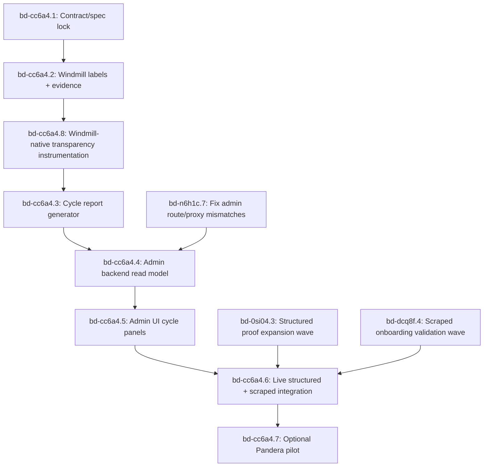

# Data-Moat Cycle Review Architecture

Date: 2026-04-27
Status: Implementation-ready spec lock
Umbrella Epic: `bd-cc6a4`
Related Epics: `bd-0si04`, `bd-dcq8f`, `bd-cwbxf`, `bd-n6h1c`
Prior Spec: `docs/specs/2026-04-13-windmill-domain-brownfield-spec-lock.md`
Review Gate: no implementation dispatch until HITL approves this spec and graph

## Summary

Affordabot needs a stable cycle-review system for 10-20 consecutive data-moat cycles that survives orchestration changes and preserves product truth. The contract in this spec establishes:

- `data_moat_cycle_report` as the canonical cycle-review artifact rendered by admin/glassbox
- Windmill-native transparency as a hard early gate for runtime evidence and orchestration metadata
- optional OSS data-quality checks only as a bounded pilot for generic structural validation

## Problem

Current surfaces are strong for run debugging but weak for cycle-over-cycle moat review:

- operators can inspect single runs, but cannot quickly answer "what changed since last cycle"
- Windmill evidence exists but is not consistently normalized into a product review object
- product-specific truth (freshness sufficiency, jurisdiction coverage, economic readiness) is mixed with runtime signals

Without a stable cycle artifact, review quality depends on workflow internals and becomes brittle when pipelines evolve.

## Goals

- Define one canonical cycle artifact: `data_moat_cycle_report`.
- Make 10-20 cycle review operationally clear for HITL users.
- Optimize the review loop for a few jurisdiction packs at a time, not a
  premature broad-corpus claim.
- Separate responsibilities cleanly:
  - Windmill: runtime evidence + links + labels
  - Affordabot backend/admin: product truth + policy interpretation + review state
- Support both structured and scraped lanes in one comparable cycle view.
- Provide implementation phases and acceptance gates that can be executed without additional architecture debates.

## Non-Goals

- Do not move product truth into Windmill scripts/apps.
- Do not replace admin/glassbox review surfaces with Windmill UI.
- Do not adopt broad OSS data-quality/catalog platforms as system-of-record.
- Do not redefine ingestion/storage truth contracts already locked by prior specs.

## Active Contract

### Review-First Gate

This document and the Beads graph are the handoff package for review. They do
not authorize implementation dispatch by themselves.

Implementation can start only after HITL approves:

- the Beads dependency graph and first executable task
- the `data_moat_cycle_report` contract
- the Windmill-native transparency checklist
- the Windmill-vs-Affordabot ownership boundary
- the sequencing between structured, scraped, LLM-enrichment, and admin work

Until then, valid work is limited to documentation/spec edits and Beads
coordination comments.

### Primary Iteration Model

The primary product loop is:

1. choose a small jurisdiction pack (normally 3-6 jurisdictions);
2. run both structured and scraped lanes for agreed source families;
3. capture Windmill-native runtime evidence for each lane/stage/provider;
4. generate `data_moat_cycle_report` deltas against the prior cycle;
5. review quality, blockers, and economic handoff state;
6. revise the pipelines or source catalog based on reason-coded misses;
7. repeat until coverage/quality is broad enough to expand the pack.

Do not optimize for a one-shot 75-120 row corpus before this loop is reliable.
The broad corpus is the destination; repeatable jurisdiction-pack iteration is
the build mechanism.

### Canonical Review Artifact

Each completed cycle writes one JSON artifact:

`artifacts/data_moat_cycle_report/<cycle_id>.json`

and exposes it through backend admin read models.

`cycle_id` format:

`<utc-date>-<run-label-or-seq>` (example: `2026-04-27-cycle-053`)

### Ownership Boundary

- Windmill owns:
  - run/job IDs, run URLs, timestamps, retry/failure metadata, labels
  - orchestration evidence links and rerun provenance
  - runtime filtering and drilldown through Runs, Jobs, Assets, Resources, and logs
- Affordabot owns:
  - cycle health verdicts and gate outcomes
  - jurisdiction/source-family completeness and deltas
  - proof sufficiency and economic handoff readiness
  - HITL review state and disposition

## Windmill-Native Transparency Checklist

This is a hard gate before cycle report generation. The primary blocker is
iteration transparency while structured and scraped pipelines change quickly.
Windmill should be used maximally for runtime transparency before custom admin
surfaces try to summarize that runtime evidence.

Required first-party Windmill surfaces:

| Surface | Required Use | Boundary |
| --- | --- | --- |
| Runs dashboard | Filter and inspect every moat-cycle run by cycle, lane, jurisdiction, source family, stage, and provider. | Runtime evidence only. |
| Static labels | Attach stable labels to flows, scripts, schedules, and manual triggers. | Labels are filters, not truth assertions. |
| Dynamic `wm_labels` | Return per-run labels from scripts for `cycle_id`, `feature_key`, `jurisdiction_id`, `source_family`, `policy_family`, `lane`, `stage`, and `provider` where known. | Missing labels warn the cycle; labels do not upgrade proof state. |
| Job result payloads | Return a small `cycle_evidence_envelope` from each relevant Windmill job. | Large artifacts stay in Affordabot storage/object storage. |
| Job/run URLs | Persist resolvable run links into `windmill_evidence[]`. | Links support audit and rerun; they do not decide pass/fail. |
| Assets | Reference S3/resource-backed artifacts using Windmill-supported asset paths where useful. | Asset presence is provenance support, not product sufficiency. |
| Resources/resource types | Prefer typed Windmill resources for repeat config such as SearXNG/S3/Postgres/OpenRouter-like integrations when secrets policy allows. | Resource config is runtime plumbing; product identity stays in Affordabot. |
| Apps | Optional operator cockpit for runtime debugging only. | Windmill Apps must not replace Affordabot admin as product-truth review UI. |

### Windmill First-Party Reuse Gate

Before implementing any custom orchestration, lineage, object-storage,
persistent-state, trigger, or tabular-processing helper, the implementer must
record why the matching Windmill-native primitive is insufficient.

Use Windmill first for:

| Need | Windmill-native default | Do not duplicate with |
| --- | --- | --- |
| Step orchestration, retries, restart-from-step, fanout, concurrency, and rate-limit pressure | Flows, scripts, schedules, failure/error handlers, concurrency controls, worker groups | A custom Python DAG runner or bespoke retry supervisor inside Affordabot. |
| Large intermediate or final datasets | Workspace object storage, S3/R2/MinIO resources, `s3object`/`S3Object` return values, and Windmill bucket explorer links | Serializing large datasets into Windmill job results, Postgres JSON blobs, or custom file-browser endpoints. |
| Dataset lineage and run-time evidence | Assets using `s3://`, `res://`, and `volume://` references, including runtime detection where supported | A parallel lineage table that only repeats read/write asset links already visible in Windmill. |
| Tabular transforms over scraped/structured datasets | DuckDB or Polars inside Windmill scripts with Windmill S3 connection helpers | A new ETL microservice or ad hoc pandas-only batch framework unless DuckDB/Polars cannot express the transform. |
| Repeat integration configuration | Windmill resources and resource types | Hard-coded provider credentials/config in flow scripts or Affordabot app settings. |
| Small operator scratch state | Windmill data tables or small persisted values when the data is orchestration-local | New Affordabot product tables for ephemeral runtime state. |
| Large data lakehouse style storage | Ducklake or workspace object storage if available and appropriate | Custom parquet cataloging code before first proving Windmill's path is insufficient. |
| Stateful cache/files for a script | Windmill volumes backed by object storage | Custom host-local cache directories with unclear lifecycle. |
| Reacting to product DB changes | Windmill Postgres triggers where self-host/runtime constraints are acceptable | Polling loops that only detect `INSERT`/`UPDATE`/`DELETE` on known tables. |

Use Affordabot custom code only for:

- product-truth verdicts, proof-state transitions, and economic handoff readiness
- stable `data_moat_cycle_report` generation and API contracts
- HITL review state, comments, dispositions, and release decisions
- source-catalog semantics that Windmill cannot know, such as official-source
  sufficiency and jurisdiction/source-family quality gates

### Existing Railway Data Substrate Binding

Windmill first-party storage guidance must wrap the current Affordabot
Railway services. It must not create a second product data substrate.

| Existing service | Remains owner of | Windmill integration posture | Anti-duplication rule |
| --- | --- | --- | --- |
| Railway Postgres | Source catalog rows, run/step metadata, proof rows, scraped candidate rows, review state, economic handoff metadata, admin read models | Register as a Windmill Postgres resource. Use scripts/flows to read/write through backend-owned contracts or narrow resource calls where invariants are preserved. Consider Postgres triggers only for event-driven orchestration when self-host/runtime constraints are acceptable. | Do not mirror product tables into Windmill data tables. Data tables are only for orchestration-local scratch state. |
| Railway pgvector | Derived retrieval index over promoted chunks and embedding metadata used by retrieval/economic analysis | Orchestrate embedding refresh, backfill, validation, and diagnostics from Windmill. Return batch IDs/counts in evidence envelopes. | Do not move embeddings into Windmill or Ducklake unless a new architecture decision replaces the retrieval substrate. |
| Railway MinIO | Raw, semi-processed, and large artifacts: pages, PDFs, CSVs, JSON payload snapshots, parquet, extracted text, screenshots, and source responses | Expose as a Windmill S3/R2/MinIO resource or workspace object storage when feasible. Use `s3://`/`S3Object` pointers, bucket explorer links, and Windmill Assets to make artifact flow visible. | Do not copy artifacts into a separate Windmill-only bucket namespace unless the path maps back to the same MinIO service/prefix policy. |
| Affordabot backend API | Product invariants, idempotency, canonical keys, proof-state transitions, and admin contracts | Windmill should call backend domain commands for product writes when those invariants matter. | Do not reimplement proof-state transition logic in Windmill scripts. |

Decision rule:

- `ALL_IN_NOW`: wire Windmill resources/assets to the existing Railway
  Postgres/pgvector/MinIO substrate and expose pointers/evidence in runs.
- `DEFER_TO_P2_PLUS`: Windmill Ducklake, data tables, or volumes for anything
  that could become product state.
- `CLOSE_AS_NOT_WORTH_IT`: replacing Railway pgvector or MinIO during the
  data-moat cycle-review work.

### Windmill Core-Concept Pain-Point Map

The implementation plan must be checked against Windmill's full core-concepts
surface, not only labels/assets/storage. This map is the required starting
point for implementation handoffs.

| Affordabot pain point | Windmill core concepts to use first | Implementation guidance |
| --- | --- | --- |
| Agents build one-off orchestration code while structured/scraped pipelines keep changing | Flows, workflows-as-code, schedules, retries, error handlers, sleeps/delays, branches, for-loops, early return, suspend/approval | Prefer Windmill orchestration primitives over custom DAG runners. Use workflows-as-code when deterministic checkpoint/replay and many parallel jurisdiction/source-family tasks are clearer than a visual flow. |
| C13 remains `orchestration_intent` rather than live runtime proof | Jobs, job runs, labels, service logs, set/get progress, streaming, rich result rendering | Every live proof must have run IDs/URLs, labels, progress/log evidence, and a small evidence envelope. Do not count planned schedules or generated configs. |
| Provider/rate-limit instability during scraped and structured probes | Worker groups, concurrency limits, job debouncing, priorities, custom timeouts, dedicated workers where available | Encode external-provider pressure in Windmill concurrency/debounce controls before adding app-side throttling supervisors. |
| Flaky discovery or official-source probes need resumability | Workflows-as-code checkpointing, task/step split, retries, cache-for-steps, pinned/mock step results for testing | Heavy external calls should be Windmill tasks with their own logs; cheap deterministic values belong in steps. Use mocks for test fixtures, not proof-state upgrades. |
| HITL needs to run small jurisdiction packs without bespoke admin forms | Auto-generated UIs, JSON schema parsing, generated script/flow inputs, instant preview/testing | Use Windmill-generated operator inputs for runtime/manual probes. Affordabot admin remains the product review surface after results are persisted. |
| Large scraped/structured artifacts become hard to inspect | Object storage, handling files/binary data, S3 proxy, Assets, DuckDB/Polars, data pipelines | Store large data in existing MinIO via Windmill S3 resources/workspace object storage and return pointers. Use DuckDB/Polars helpers for tabular inspection/transforms. |
| Product DB changes may require follow-on orchestration | Postgres triggers, webhooks, HTTP routes, preprocessors | Prefer triggers/routes over polling when deployment constraints allow. Preprocessors may normalize incoming runtime requests, but product state transitions stay in backend contracts. |
| Secrets and provider config drift across flows | Resources/resource types, variables/secrets, environment variables, workspace secret encryption, user tokens, RBAC/groups/folders | Use Windmill resources for SearXNG/Postgres/MinIO/provider config when allowed by agent-safe secret policy. Avoid hard-coded credentials in scripts. |
| Agents duplicate storage for scratch state or caches | Caching, small persisted state, volumes, data tables, Ducklake | Use these only for orchestration-local state/caches. Do not create a second product database or vector/artifact substrate. |
| Runtime debugging gets confused with product review | Full-code apps, low-code apps, rich displays, search bar/content search/full-text log search where available | Windmill apps/search can be operator cockpits for runtime debugging. They must not replace Affordabot admin/glassbox review or `data_moat_cycle_report`. |
| Pipeline changes are hard to govern across agents | Workflows as code, CLI sync, git sync, draft/deploy, workspace forks, protection rules, CI test scripts, infrastructure as code | Keep Windmill assets repo-local and reviewable. Prefer git-synced/CLI-managed assets over ad hoc UI-only edits. |
| Browser or AI helpers tempt scope creep | Browser automation, run Docker containers, Windmill AI, AI agents, AI sandbox | Treat as optional implementation aids only. They cannot be required proof sources, cannot replace official structured-source probes, and cannot be critical-path jurisdiction-to-keyword logic without measured uplift. |

`bd-cc6a4.8` must include a short native-reuse audit in its PR or handoff:

- which Windmill primitives were used
- which primitives were explicitly not used
- why any custom code was necessary
- how the implementation handled generated UIs, progress/streaming,
  worker groups/concurrency/debouncing, and git/CLI governance without
  duplicating Windmill-native capabilities
- whether the choice is `ALL_IN_NOW`, `DEFER_TO_P2_PLUS`, or
  `CLOSE_AS_NOT_WORTH_IT`

Minimum `cycle_evidence_envelope`:

```json
{
  "contract_version": "2026-04-27.windmill-cycle-evidence.v1",
  "cycle_id": "2026-04-27-cycle-053",
  "feature_key": "bd-cc6a4",
  "lane": "structured",
  "stage": "probe",
  "jurisdiction_id": "oakland-ca",
  "source_family": "permits",
  "policy_family": "housing",
  "provider": "arcgis",
  "status": "succeeded",
  "windmill": {
    "workspace": "affordabot",
    "flow_path": "f/affordabot/data_moat_cycle",
    "job_id": "019...",
    "run_url": "https://..."
  },
  "evidence_refs": [],
  "asset_refs": [],
  "resource_refs": [],
  "summary_counts": {},
  "failure": null
}
```

Required validation:

- static tests fail if committed moat-cycle Windmill flows/scripts omit required labels
- static tests fail if wrappers stop returning `cycle_evidence_envelope`
- at least one live or recorded run proves labels are filterable in Windmill Runs
- cycle report generator refuses to treat Windmill labels as proof-state upgrades

### Review State Machine

`pending_review` -> `in_review` -> `approved` | `blocked` | `needs_rerun`

`blocked` requires at least one blocker code and owner field.

## Data Model: `data_moat_cycle_report`

Minimum required top-level shape:

```json
{
  "contract_version": "2026-04-27.data-moat-cycle-review.v1",
  "cycle_id": "2026-04-27-cycle-053",
  "generated_at": "2026-04-27T16:20:00Z",
  "window": {
    "from": "2026-04-26T16:20:00Z",
    "to": "2026-04-27T16:20:00Z",
    "cadence": "daily"
  },
  "summary": {},
  "delta_metrics": {},
  "jurisdiction_source_family_grid": [],
  "proof_rows": [],
  "scraped_cells": [],
  "provider_failures": [],
  "economic_handoff": {},
  "windmill_evidence": [],
  "review": {}
}
```

Field contract:

| Field | Type | Required | Description |
| --- | --- | --- | --- |
| `summary` | object | yes | Cycle totals and top-line gate status. |
| `delta_metrics` | object | yes | Changes vs previous cycle (absolute + percent). |
| `jurisdiction_source_family_grid` | array | yes | One row per jurisdiction x source_family status cell. |
| `proof_rows` | array | yes | Structured proof rows for official/structured sources. |
| `scraped_cells` | array | yes | Scraped-lane coverage and extraction quality cells. |
| `provider_failures` | array | yes | Provider-level failure taxonomy with retry class and impact. |
| `economic_handoff` | object | yes | Analysis readiness, blockers, and missing-evidence reasons. |
| `windmill_evidence` | array | yes | Job/run links and runtime metadata references only. |
| `review` | object | yes | HITL owner, state, decision, notes, reviewed_at. |

Required `summary` keys:

- `gate_status`: `pass` | `warn` | `fail`
- `cycles_compared`: integer
- `jurisdictions_total`: integer
- `source_families_total`: integer
- `analysis_ready_count`: integer
- `blocked_count`: integer

Required `delta_metrics` keys:

- `new_documents`
- `updated_documents`
- `stale_documents`
- `freshness_pass_rate`
- `evidence_sufficiency_pass_rate`
- `analysis_ready_delta`

Each delta entry shape:

```json
{
  "current": 0,
  "previous": 0,
  "delta_abs": 0,
  "delta_pct": 0.0
}
```

`jurisdiction_source_family_grid[]` row shape:

```json
{
  "jurisdiction_id": "san-jose-ca",
  "source_family": "meeting_minutes",
  "policy_family": "housing",
  "status": "live_proven",
  "previous_status": "cataloged_intent",
  "delta": "upgraded",
  "freshness_hours": 12,
  "coverage_count": 48,
  "analysis_ready": true,
  "proof_state": "live_proven",
  "stream": "structured",
  "blocker_codes": []
}
```

`proof_rows[]` minimum fields:

- `proof_id`
- `jurisdiction_id`
- `source_family`
- `policy_family`
- `source_type` (`structured`)
- `row_identity`
- `extraction_depth`
- `source_ref` (URI or catalog key)
- `endpoint`
- `row_count`
- `schema_fingerprint`
- `freshness_status`
- `provenance_ref`
- `windmill_evidence_ref`
- `economic_usable` (boolean)

Structured rows may upgrade `cataloged_intent` to `live_proven` only when the
proof row matches row identity, jurisdiction, source family, and extraction
depth. Partial matches must remain `cataloged_intent` or `blocked` with reason
codes.

`scraped_cells[]` minimum fields:

- `cell_id`
- `jurisdiction_id`
- `source_family`
- `policy_family`
- `query_family`
- `provider`
- `artifact_recall_top_n`
- `selected_candidate_quality`
- `reader_substance_verdict`
- `fallback_triggered`
- `official_validated`
- `extractable`
- `stored_provenanced`
- `missing_reason_code`
- `llm_suggestion_ref` (optional; advisory-only)

`provider_failures[]` minimum fields:

- `provider`
- `stage` (`search`, `reader`, `ingestion`, `analysis`)
- `failure_code`
- `retry_class`
- `impact_scope` (`cell`, `family`, `jurisdiction`, `cycle`)
- `windmill_job_id` (optional but preferred)

`economic_handoff` minimum fields:

- `ready`: boolean
- `blockers`: string[]
- `missing_claim_classes`: string[]
- `assumption_risk`: `low` | `medium` | `high`

`windmill_evidence[]` minimum fields:

- `flow_path`
- `job_id`
- `run_id`
- `run_url`
- `status`
- `started_at`
- `ended_at`
- `labels`

## Windmill Label Taxonomy

All Affordabot moat-cycle jobs must include these labels.

Required static labels:

- `product:affordabot`
- `review_surface:data_moat_cycle`
- `env:dev` (or deployment environment)
- `moat:data`

Required dynamic labels:

- `cycle:<cycle_id>`
- `feature_key:<bd-id>`
- `jurisdiction:<jurisdiction_id>`
- `source_family:<source_family>`
- `policy_family:<policy_family>` where known
- `lane:<structured|scraped>`
- `stage:<plan|search|probe|read|validate|store|index|analyze|publish>`
- `provider:<provider>`

Label policy:

- labels are evidence handles for filtering, not truth assertions
- backend validates and normalizes labels into `windmill_evidence[]`
- missing required labels downgrades cycle gate to `warn`
- missing labels block `bd-cc6a4.8` and therefore block cycle report generation

## HITL Workflow: Reviewing 10-20 Cycles

### Review Timeline

1. Load cycle list with latest 20 `data_moat_cycle_report` rows.
2. Default compare window: latest cycle vs previous cycle, plus 7-cycle trend sparkline.
3. Expand to 10-20 cycle mode for drift/regression review.
4. Open a cycle detail panel with:
   - delta metric table
   - jurisdiction/source-family grid
   - proof rows and scraped cells
   - provider failures and Windmill links
   - economic handoff blockers
5. Set review disposition (`approved`, `blocked`, or `needs_rerun`) with notes.

### Required Comparison Views

- Delta metrics: absolute and percent change for each key gate metric.
- Jurisdiction/source-family grid: status transitions (`healthy` -> `warn` -> `blocked`).
- Proof rows: missing provenance, stale official records, broken structured feeds.
- Scraped cells: low artifact recall, weak selected-candidate quality, reader no-substance outcomes.
- Provider failure panel: grouped by provider/stage with impact scope.
- Economic handoff panel: explicit blocker list and unresolved claim classes.
- Windmill evidence links: direct run URL for every impacted row/cell.

### Operator Decision Rules

- `approved` only if:
  - no `fail` gate in summary
  - no unresolved economic blockers
  - no jurisdiction/source-family cell in `blocked` without owner
- `blocked` when:
  - provider failures create unresolved cycle-level or jurisdiction-level impact
  - economic handoff is not ready
- `needs_rerun` when:
  - runtime incident is recoverable and policy allows rerun without data-risk

## Architecture Fit With Existing Surfaces

The cycle-review contract sits above existing run-debugging surfaces. It should
reuse them, not replace them.

Backend read-model candidates found by static discovery include:

- `backend/services/glass_box.py::list_pipeline_runs`
- `backend/routers/admin.py::list_pipeline_runs`
- `backend/routers/admin.py::get_pipeline_run_read_model`
- `backend/routers/admin.py::get_pipeline_run_steps_read_model`
- `backend/routers/admin.py::get_pipeline_run_evidence`

Frontend/admin candidate surface:

- `frontend-v2/src/components/GlassBoxViewer.tsx`

Implementation may add new cycle-specific backend endpoints, but browser code
must continue to read backend/admin APIs. The browser must not call Windmill,
Postgres, pgvector, or object storage directly.

## Stream Inputs

All streams must use the same cycle cell identity:

```text
cycle_id + jurisdiction_id + source_family + policy_family + lane + stage
```

This identity is how Windmill labels, proof rows, scraped cells, provider
failures, storage artifacts, and admin review rows join without depending on
the internal shape of a specific pipeline implementation.

### Structured Stream

Source epic: `bd-0si04`.

The structured stream contributes `proof_rows[]` and structured
`jurisdiction_source_family_grid[]` cells. The main product question is whether
runtime proof has real breadth and depth across public/free official structured
sources, not whether the adapter architecture exists.

Structured outputs required before live cycle integration:

- target matrix with jurisdiction, source family, endpoint, and extraction depth
- live probe results with row count and schema fingerprint
- false-proof rejection evidence
- regenerated matrix, scorecard, report, manual audit, and ledger

### Scraped Stream

Source epic: `bd-dcq8f`.

The scraped stream contributes `scraped_cells[]`, provider health, official
validation outcomes, extractability, stored/provenanced status, and missing-cell
reason codes.

The product question is whether a new jurisdiction can move from
jurisdiction profile to deterministic query matrix to official-source candidate
to extractable/stored evidence without relying on flaky Z.ai search.

Scraped outputs required before live cycle integration:

- deterministic jurisdiction/source-family query artifacts
- SearXNG retrieval artifacts with provider health and zero silent fallback
- official-source validation and extractability classifiers
- 6-jurisdiction x 6-source-family validation wave results
- baseline-vs-current comparison showing which query templates improved or regressed

### LLM Enrichment Stream

Source epic: `bd-cwbxf`.

LLM enrichment is advisory and non-critical. It may suggest aliases, platform
hints, and additional query variants for weak/missing cells after deterministic
baseline evidence exists. It must not validate truth, replace canonical queries,
declare absence, or block cycle completion.

`bd-cwbxf` is not a blocker for the first cycle-review implementation path.
It becomes relevant after `bd-dcq8f.4` identifies weak or missing cells worth
enriching.

## Implementation Phases

### Phase 1: Contract + Read Model

- Finalize JSON contract and backend serialization for `data_moat_cycle_report`.
- Persist cycle rows and previous-cycle references for delta computation.
- Add API reads for cycle list, cycle detail, and cycle compare.

### Phase 2: Windmill-Native Runtime Transparency

- Enforce required static labels and dynamic `wm_labels` on moat-cycle flows/jobs.
- Return `cycle_evidence_envelope` from relevant Windmill scripts.
- Capture Windmill run metadata, run URLs, labels, asset refs, and resource refs into `windmill_evidence`.
- Add missing-label warning in cycle summary gate and block report generation until instrumentation exists.

### Phase 3: Cycle Report Generation

- Generate `data_moat_cycle_report` only after Windmill-native transparency is in place.
- Compare current cycle to prior cycle with stable delta semantics.
- Normalize structured proof rows, scraped cells, provider failures, and economic blockers.

### Phase 4: Admin/Glassbox Cycle Review Surface

- Add cycle list and detail views focused on 10-20 cycle review.
- Add compare view with delta metrics and jurisdiction/source-family grid.
- Render proof rows, scraped cells, provider failures, and economic blockers.

### Phase 5: Bounded OSS Data-Quality Pilot (Optional)

- Pilot only one lightweight validator path for generic structural checks.
- Scope limited to schema/null/range validation for structured snapshots and chunk metadata.
- Pilot outputs annotate cycle report diagnostics; they do not override product truth gates.

## Validation Gates

### Gate A: Artifact Completeness

- Every completed cycle writes one valid `data_moat_cycle_report`.
- Contract validation passes with no missing required fields.

### Gate B: Review Usability

- HITL can review latest 10 and latest 20 cycles without manual SQL/log digging.
- Delta metrics and grid transitions are visible and sortable.
- HITL can review one jurisdiction pack and answer which source-family cells
  improved, regressed, stayed missing, or need pipeline/source-catalog revision.

### Gate C: Evidence Traceability

- Every provider failure and blocker row has a resolvable Windmill run URL or explicit `not_available` reason.
- Proof rows and scraped cells expose provenance refs.
- Every relevant Windmill run is filterable by required labels.
- Every relevant Windmill job returns or links to a `cycle_evidence_envelope`.

### Gate D: Boundary Integrity

- No product truth logic moved into Windmill scripts/apps.
- Admin cycle verdicts are backend-calculated; Windmill data remains evidence-only.

### Gate E: Native Reuse Integrity

- No custom DAG, retry, lineage, object-browser, storage, trigger, or tabular
  processing helper is added without first documenting the relevant
  Windmill-native primitive and the reason it is insufficient.
- `bd-cc6a4.8` includes a native-reuse audit covering flows, assets, workspace
  object storage, resources/resource types, data tables/Ducklake/volumes, and
  Postgres triggers.
- Large artifacts are represented as S3/object-storage pointers whenever
  practical; job results remain small evidence envelopes.
- Custom Affordabot code is limited to product truth, review semantics,
  source-catalog quality, and economic handoff readiness.

## Risks and Mitigations

| Risk | Impact | Mitigation |
| --- | --- | --- |
| Report contract drifts with pipeline internals | Breaks long-range comparability | Keep cycle report schema stable and versioned; add additive fields only. |
| Windmill labels missing or inconsistent | Weak run filtering and traceability | Required label taxonomy + hard `bd-cc6a4.8` gate before report generation. |
| Rebuilding Windmill first-party primitives | Maintenance tax and lower observability | Require a native-reuse audit before custom orchestration, lineage, storage, trigger, or ETL helper code. |
| Custom admin duplicates Windmill runtime UI | Maintenance tax and confusing operator surfaces | Use Windmill Runs/Assets/Resources/Apps for runtime drilldown; admin owns product review only. |
| Runtime data mistaken as product truth | Incorrect operator decisions | Enforce boundary in API contracts and admin copy: Windmill is evidence, backend is truth. |
| OSS pilot scope creep | Added maintenance tax | Bounded pilot gate with explicit stop/continue criteria. |
| Economic blockers hidden in summary | False "green" cycles | Mandatory `economic_handoff.blockers` rendering and decision rule. |

## Beads Dependency Graph

Umbrella epic:

- `bd-cc6a4`: Data moat cycle review architecture hardening

Primary execution chain:

1. `bd-cc6a4.1`: Spec revised `data_moat_cycle_report` contract and ownership boundaries
2. `bd-cc6a4.2`: Define Windmill-native transparency and run-evidence contract
3. `bd-cc6a4.8`: Implement Windmill-native transparency instrumentation before report generation
4. `bd-cc6a4.3`: Implement cycle report generator with delta semantics
5. `bd-cc6a4.4`: Expose cycle report via admin read model and backend endpoints
6. `bd-cc6a4.5`: Implement admin UI cycle-review panels for moat deltas
7. `bd-cc6a4.6`: Run live cycle integration across structured and scraped waves
8. `bd-cc6a4.7`: Optional pilot: add bounded Pandera checks for repeated tabular validations

Blocking edges:

- `bd-cc6a4.1` blocks `bd-cc6a4.2`
- `bd-cc6a4.2` blocks `bd-cc6a4.8`
- `bd-cc6a4.8` blocks `bd-cc6a4.3`
- `bd-cc6a4.3` blocks `bd-cc6a4.4`
- `bd-n6h1c.7` blocks `bd-cc6a4.4`
- `bd-cc6a4.4` blocks `bd-cc6a4.5`
- `bd-cc6a4.5` blocks `bd-cc6a4.6`
- `bd-0si04.3` blocks `bd-cc6a4.6`
- `bd-dcq8f.4` blocks `bd-cc6a4.6`
- `bd-cc6a4.6` blocks `bd-cc6a4.7`

Graph:



Related epic sequencing:

- Structured path `bd-0si04`: `.1 -> .2 -> .3 -> .4`
- Scraped path `bd-dcq8f`: `.1` blocks `.2` and `.3`; `.2 + .3 -> .4 -> .5`
- LLM enrichment `bd-cwbxf`: `bd-dcq8f.4 -> .1 -> .2 -> .3 -> .4`
- Admin glassbox `bd-n6h1c`: `.7` must close before `bd-cc6a4.4`; `.4` depends on both `bd-0si04.3` and `bd-dcq8f.4`

First executable task after HITL approval:

- `bd-cc6a4.1`

Why first: the contract and Windmill-native transparency gate must be frozen
before backend serialization or UI panels are implemented. Otherwise the team
risks building admin summaries that cannot be audited in Windmill as the
structured and scraped pipelines change.

## Implementation Dispatch Boundaries

After this spec is approved, dispatch should be by outcome:

- Agent A: `bd-cc6a4.1` and `bd-cc6a4.2` only if kept tightly scoped to contract and Windmill evidence taxonomy.
- Agent B: `bd-cc6a4.8` only after `.1` and `.2` are accepted.
- Agent C: `bd-cc6a4.3` only after `.8` proves Windmill-native transparency.
- Agent D: `bd-cc6a4.4` only after `.3` and `bd-n6h1c.7` are complete.
- Agent E: `bd-cc6a4.5` only after backend payloads exist.
- No agent should start `bd-cc6a4.6` until `bd-0si04.3`, `bd-dcq8f.4`, and `bd-cc6a4.5` are complete.

Do not dispatch `bd-cc6a4.7` unless live integration shows repeated tabular
validation pain that a lightweight Pandera pilot would actually reduce.

## Concrete Acceptance Criteria

- [ ] New cycle artifact contract exists and is versioned as `2026-04-27.data-moat-cycle-review.v1`.
- [ ] Windmill-native transparency is proven before cycle report generation: labels, `wm_labels`, run URLs, evidence envelopes, and asset/resource policy.
- [ ] Windmill first-party reuse audit is complete before custom orchestration, lineage, object-storage, persistent-state, trigger, or tabular-processing code is accepted.
- [ ] Latest 20 cycles can be listed with gate status, blocker count, and review state.
- [ ] Cycle detail includes delta metrics, jurisdiction/source-family grid, proof rows, scraped cells, provider failures, economic blockers, and Windmill run links.
- [ ] Review state machine (`pending_review`, `in_review`, `approved|blocked|needs_rerun`) is persisted and visible.
- [ ] Windmill labels follow required taxonomy for moat-cycle jobs.
- [ ] Missing Windmill labels appear as `warn` in cycle summary.
- [ ] Boundary is documented in cron, windmill, and architecture docs: Windmill runtime evidence; Affordabot product truth.
- [ ] Optional OSS DQ path is explicitly bounded as pilot-only and cannot become product truth without a new decision.
